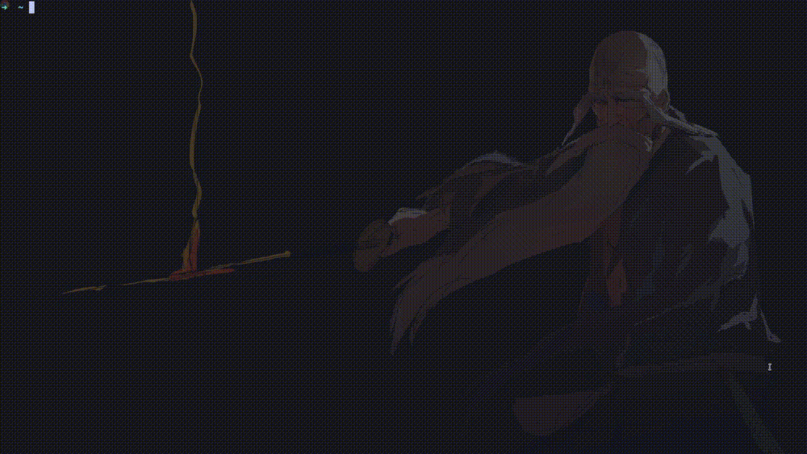

<div align="center">
  
</div>

<h1 align="center">🌶️ SLSA</h1>
<p>
    <strong>Silly Linux Shenanigans Archive</strong>: is a silly repo to collect all the fun useless stuff you can do in your terminal in linux.
    if you want to have fun and have a silly moment with your friends, you may found some of them fun.
</p>

## Installtion of any of the following tools will be probably as follows:

```bash
sudo apt install <app-name>
```

**example:**

```bash
sudo apt insatall cmatrix cowsay fortune
```

### The basics (cmatrix):

Every wanted that matrix movie effect and feel like you're a real hacker, here is your dreams come true:
just run:

```bash
camtrix
```


### want a train in your terminal

```bash
sl
```


