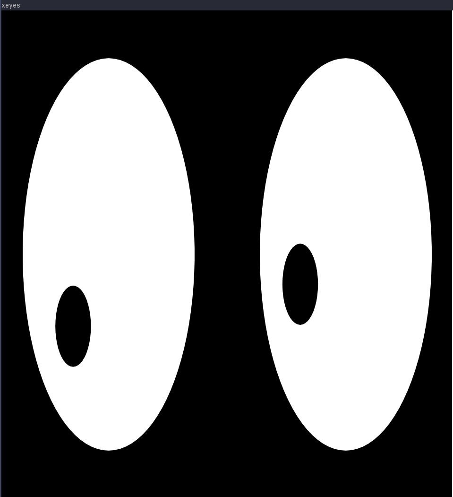
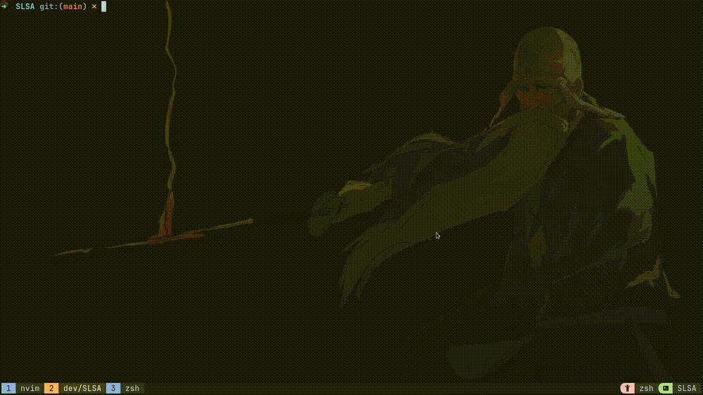

<div align="center">
  
</div>

<h1 align="center">🌶️ SLSA</h1>
<p>
    <strong>Silly Linux Shenanigans Archive</strong>: is a silly repo to collect all the fun useless stuff you can do in your terminal in Linux.
    if you want to have fun and have a silly moment with your friends, you may find some of them fun.
</p>

## Installation of any of the following tools will be probably as follows:

```bash
sudo apt install <app-name>
```

**Example:**

```bash
sudo apt install cmatrix cowsay fortune
```

## Let's start the ✨ _fun_ ✨

<br />

### 🌟 The basics (cmatrix):

Ever wanted that matrix movie effect and feel like you're a real hacker, here are your dreams come true:
just run:

```bash
camtrix
```


<br />

### 🚂 want a train in your terminal

```bash
sl
```


<br />

### 🐮 How about a cow that thinks and says whatever you want

```bash
cowsay <anything>
```

or

```bash
cowthink <anything>
```


<br />

### 🥠 Wouldn't be great if you could know your fortune in your terminal?!

```bash
fortune
```


Ok, that wasn't useful.

<br />

### 🧘 But what if it was said by the wise cow:

```bash
fortune | cowsay
```


<br />

### 🍭It needs more color, doesn't it? how about more _lolcat_

```bash
fortune | cowsay | lolcat
```


- lolcat generally can give any text output a splash of color try piping different things to it.

<br />

### 🚽 despite the name it's actually useful wanna know about toilet?

```bash
toilet --metal "Mister Meow"
```


toilet can also do some fancy stuff here is a terminal clock made with toilet.

```bash
while true; do echo "$(date '+%D %T' | toilet -f term -F border --gay)"; sleep 1;clear; done
```


<br />

### 😸 Let's start the followers:

1. Here are eyes that follow your mouse:

```bash
xeyes
```



2. For all my fellow cat lovers here is a cat that follows your mouse

```bash
onkeo
```


