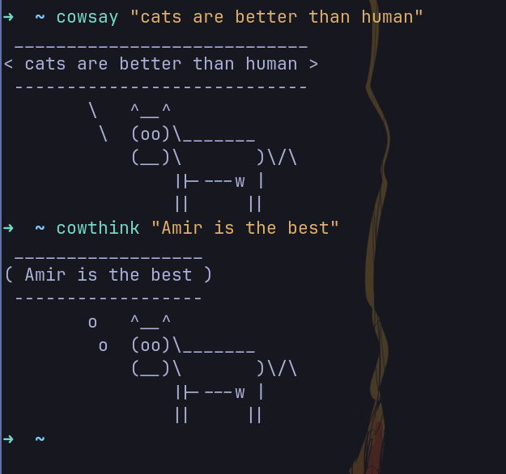
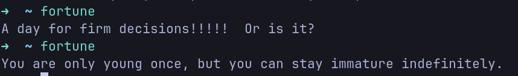
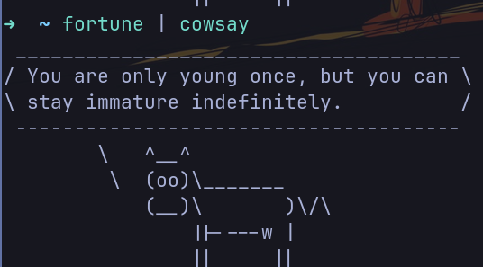
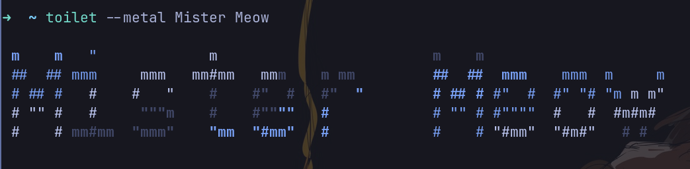
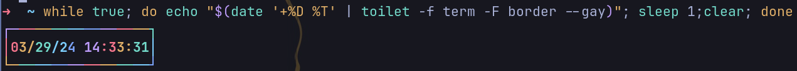

<div align="center">
  
</div>

<h1 align="center">🌶️ SLSA</h1>
<p>
    <strong>Silly Linux Shenanigans Archive</strong>: is a silly repo to collect all the fun useless stuff you can do in your terminal in linux.
    if you want to have fun and have a silly moment with your friends, you may found some of them fun.
</p>

## Installtion of any of the following tools will be probably as follows:

```bash
sudo apt install <app-name>
```

**example:**

```bash
sudo apt insatall cmatrix cowsay fortune
```

## Let's start the ✨ _fun_ ✨

<br /><br /><br /><br />

### The basics (cmatrix):

Every wanted that matrix movie effect and feel like you're a real hacker, here is your dreams come true:
just run:

```bash
camtrix
```


<br /><br /><br /><br />

### want a train in your terminal

```bash
sl
```


<br /><br /><br /><br />

### How about the a cow that thinks and says whatever you want

```bash
cowsay <anything>
```

or

```bash
cowthink <anything>
```



<br /><br /><br /><br />

### Wouldn't be great if you can know your fortune in you terminal?!

```bash
fortune
```



Ok that wasn't useful.

<br /><br /><br /><br />

### But what if it was said by the wise cow:

```bash
fortune | cowsay
```



<br /><br /><br /><br />

### It needs more color doesn't it? how about more _lolcat_

```bash
fortune | cowsay | lolcat
```


- lolcat generaly can give any text output a splach of color try piping differnet things to it.

<br /><br /><br /><br />

### dispite the name it's actually useful wanna know about toilet?

```bash
toilet --metal "Mister Meow"
```



toilet can also do some fancy stuff here is a terminal clock made with toilet.

```bash
while true; do echo "$(date '+%D %T' | toilet -f term -F border --gay)"; sleep 1;clear; done
```


